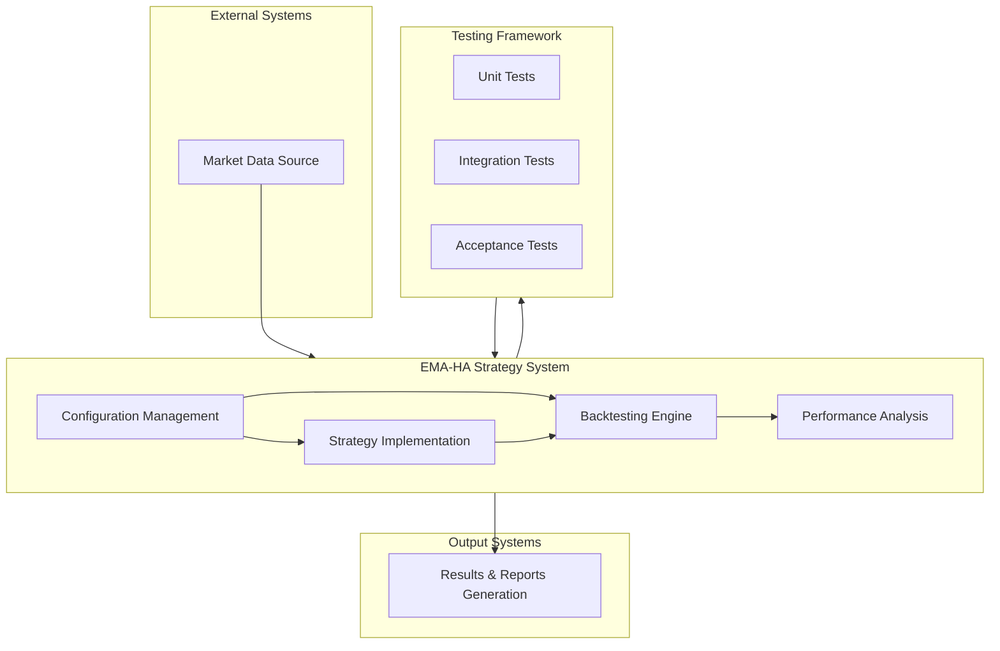

# EMA Heikin Ashi Strategy - System Architecture

This diagram provides a high-level overview of the EMA Heikin Ashi Strategy system architecture.

## System Architecture Diagram

## Components Description

### External Systems
- **Market Data Source**: Provides historical price data for backtesting

### EMA-HA Strategy System
- **Configuration Management**: Handles system configuration via YAML files
- **Strategy Implementation**: Implements the EMA Heikin Ashi trading strategy
- **Backtesting Engine**: Executes the strategy against historical data
- **Performance Analysis**: Calculates performance metrics and statistics

### Output Systems
- **Results & Reports Generation**: Creates Excel reports and visualizations

### Testing Framework
- **Unit Tests**: Tests individual components
- **Integration Tests**: Tests component interactions
- **Acceptance Tests**: Validates system behavior against requirements
