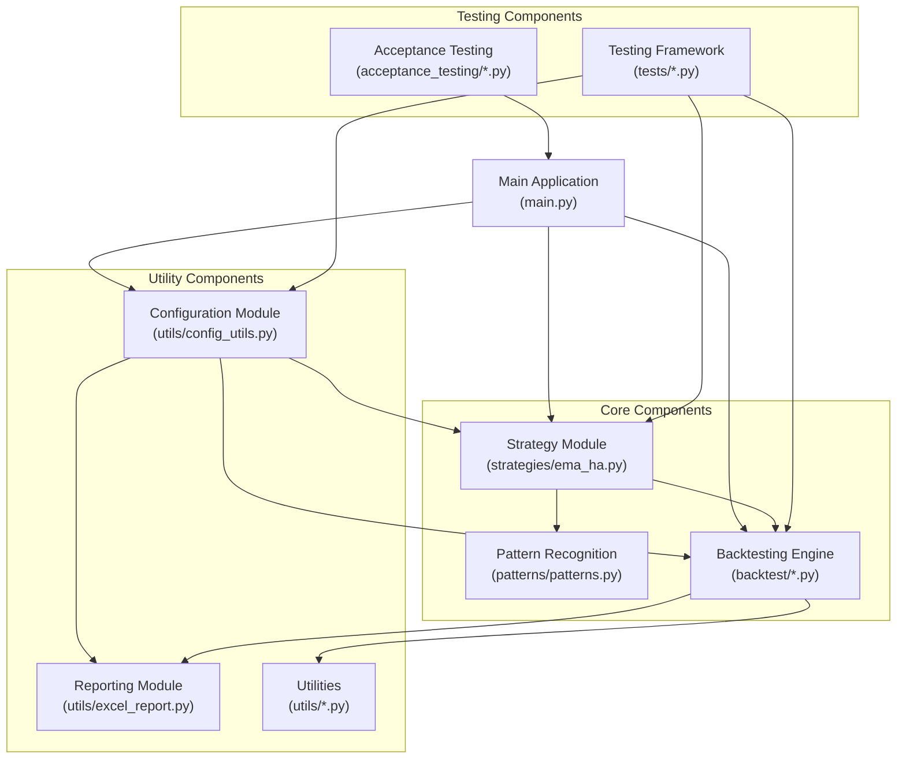

# EMA Heikin Ashi Strategy - Component Diagram

This diagram shows the main components of the EMA Heikin Ashi Strategy system and their relationships.

## Component Diagram

## Component Descriptions

### Main Application
- **main.py**: Entry point for the application, handles command-line arguments and orchestrates the workflow

### Core Components
- **Strategy Module**: Implements the EMA Heikin Ashi trading strategy
- **Pattern Recognition**: Detects Heikin Ashi candle patterns
- **Backtesting Engine**: Executes the strategy against historical data

### Utility Components
- **Configuration Module**: Manages system configuration
- **Reporting Module**: Generates Excel reports and visualizations
- **Utilities**: Common utility functions used throughout the system

### Testing Components
- **Testing Framework**: Unit and integration tests
- **Acceptance Testing**: End-to-end tests for validating system behavior
