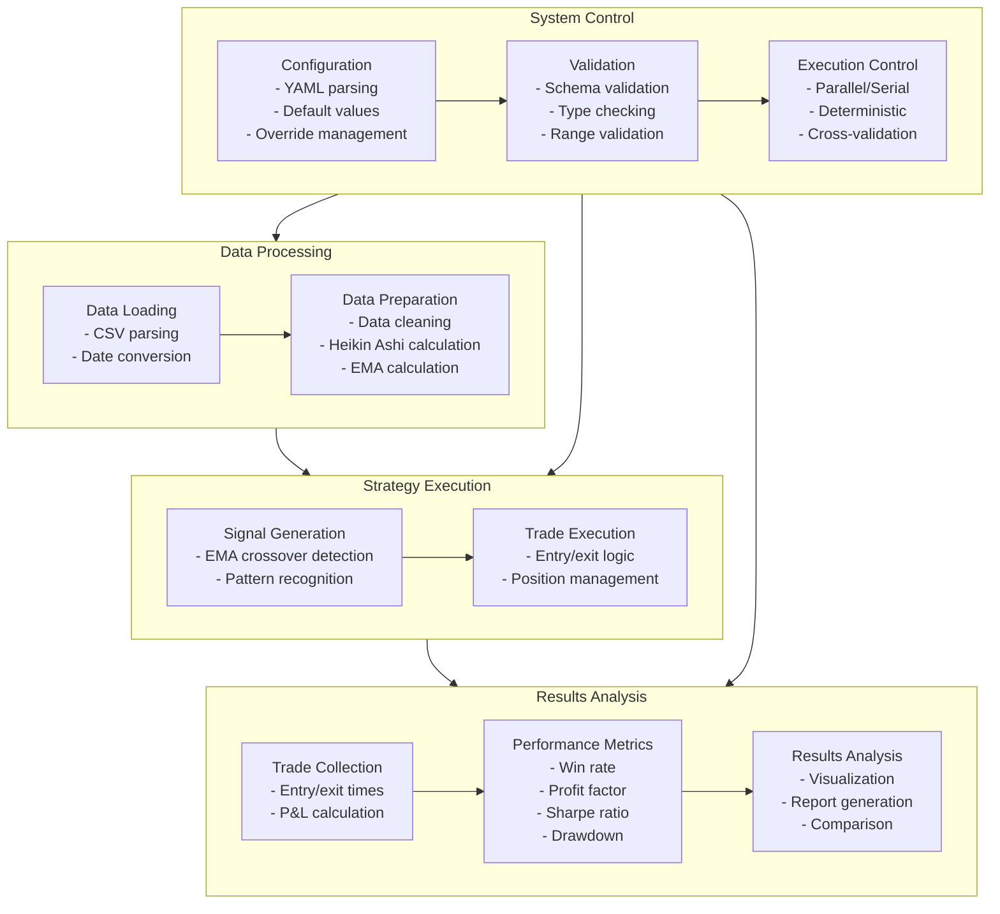

# EMA Heikin Ashi Strategy - System Design

This diagram illustrates the detailed system design and data flow of the EMA Heikin Ashi Strategy system.

## System Design Diagram

## Design Components Description

### Data Processing
- **Data Loading**: Loads market data from CSV files
- **Data Preparation**: Prepares data for strategy execution, including calculating Heikin Ashi candles and EMAs

### Strategy Execution
- **Signal Generation**: Generates trading signals based on EMA crossovers and Heikin Ashi patterns
- **Trade Execution**: Executes trades based on signals, manages positions and risk

### Results Analysis
- **Trade Collection**: Collects trade data including entry/exit times and P&L
- **Performance Metrics**: Calculates performance metrics such as win rate, profit factor, and Sharpe ratio
- **Reporting**: Generates reports and visualizations for analysis

### System Control
- **Configuration**: Manages system configuration via YAML files
- **Validation**: Validates configuration and input data
- **Execution Control**: Controls execution mode (parallel/serial, deterministic)
