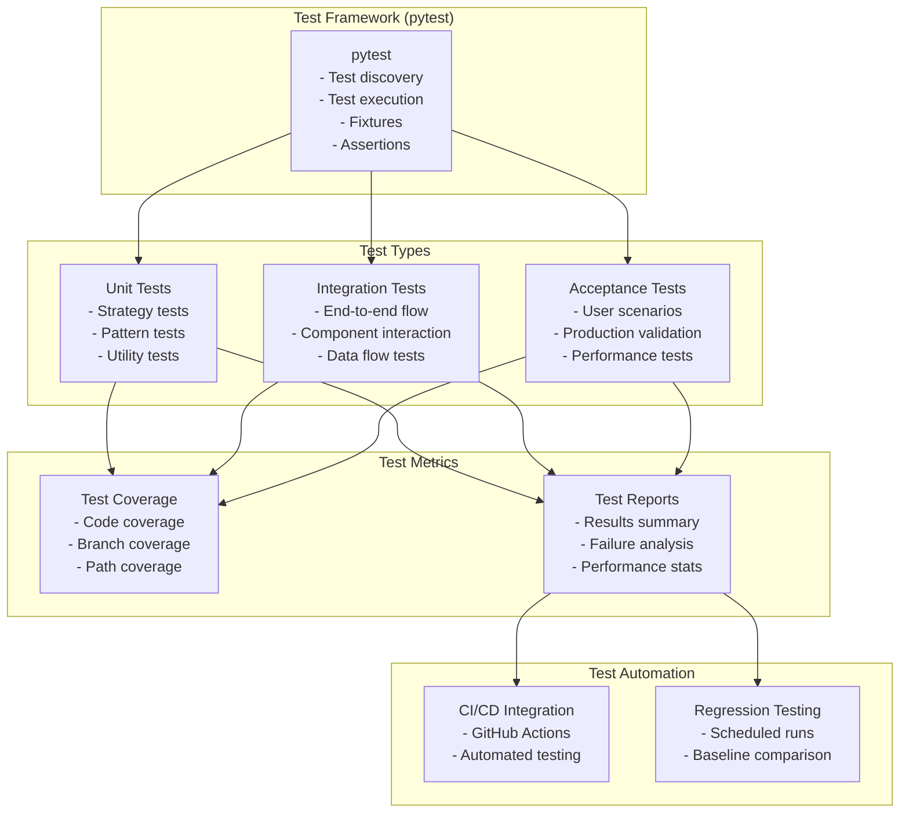

# EMA Heikin Ashi Strategy - Test Architecture

This diagram illustrates the testing architecture of the EMA Heikin Ashi Strategy system.

## Test Architecture Diagram

## Test Architecture Components

### Test Framework
- **pytest**: The main testing framework used for all levels of testing

### Test Types
- **Unit Tests**: Tests for individual components and functions
- **Integration Tests**: Tests for component interactions and data flow
- **Acceptance Tests**: End-to-end tests that validate system behavior against requirements

### Test Metrics
- **Test Coverage**: Measures how much of the code is covered by tests
- **Test Reports**: Summarizes test results and provides analysis

### Test Automation
- **CI/CD Integration**: Integrates testing with continuous integration and deployment
- **Regression Testing**: Ensures that new changes don't break existing functionality
