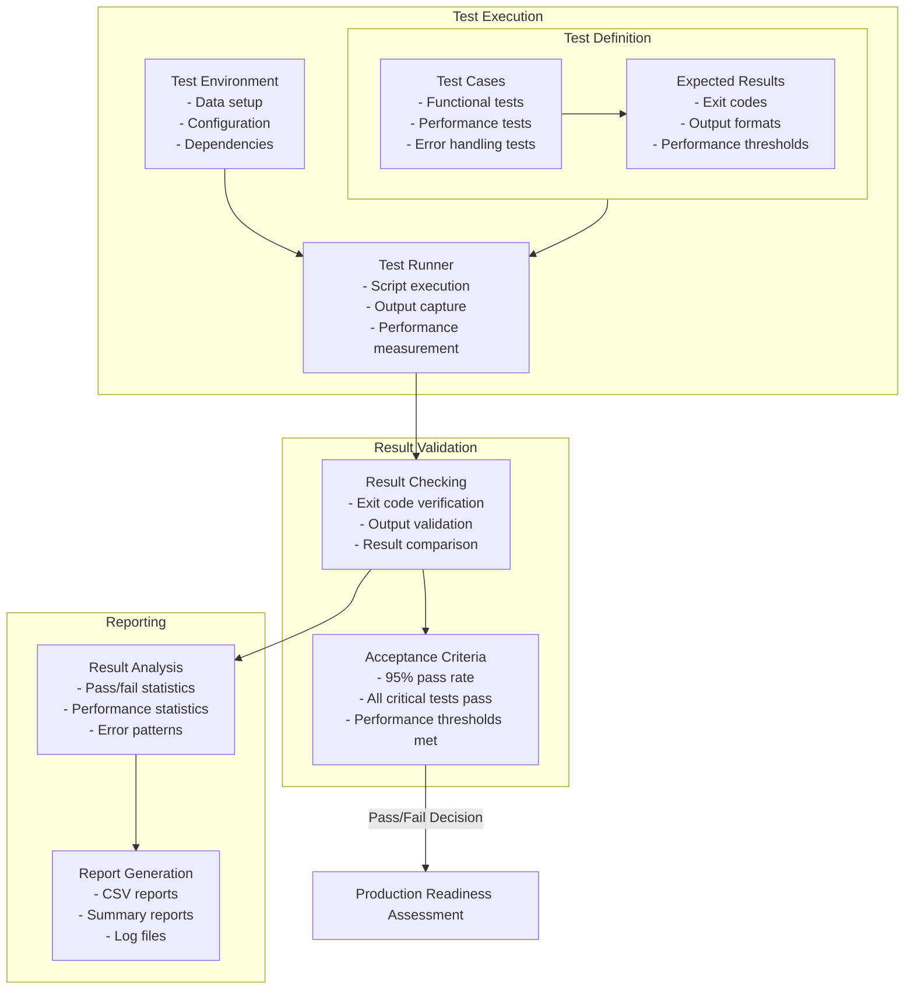

# EMA Heikin Ashi Strategy - Acceptance Testing Workflow

This diagram illustrates the acceptance testing workflow for the EMA Heikin Ashi Strategy system.

## Acceptance Testing Workflow Diagram

## Acceptance Testing Workflow Components

### Test Definition
- **Test Cases**: Defines the tests to be executed
- **Expected Results**: Defines the expected outcomes of each test

### Test Execution
- **Test Runner**: Executes the tests and captures results
- **Test Environment**: Sets up the environment for testing

### Result Validation
- **Result Checking**: Validates test results against expected outcomes
- **Acceptance Criteria**: Defines the criteria for acceptance

### Reporting
- **Result Analysis**: Analyzes test results for patterns and issues
- **Report Generation**: Generates reports summarizing test results

### Production Readiness
- **Production Readiness Assessment**: Determines if the system is ready for production based on acceptance test results
