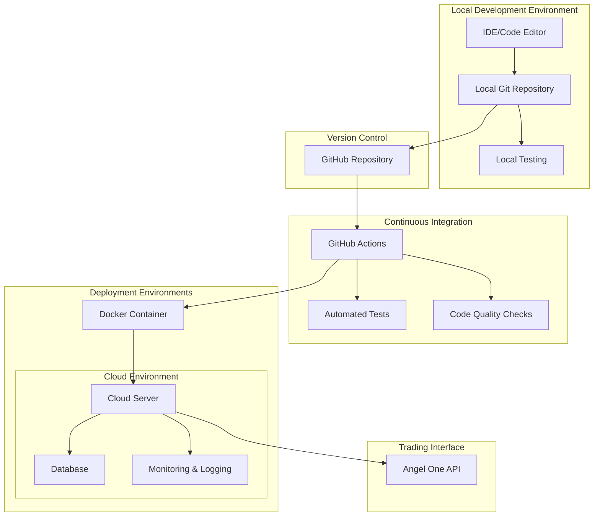

# EMA Heikin Ashi Strategy - Deployment Architecture

This diagram illustrates the deployment architecture for the EMA Heikin Ashi Strategy system.

## Deployment Architecture Diagram

## Deployment Architecture Components

### Local Development Environment
- **IDE/Code Editor**: Development environment for writing and testing code
- **Local Git Repository**: Local version control
- **Local Testing**: Running tests locally before pushing to GitHub

### Version Control
- **GitHub Repository**: Central repository for code storage and collaboration

### Continuous Integration
- **GitHub Actions**: Automated CI/CD pipeline
- **Automated Tests**: Running tests automatically on code changes
- **Code Quality Checks**: Ensuring code quality standards

### Deployment Environments
- **Docker Container**: Containerized application for consistent deployment
- **Cloud Environment**: Cloud-based deployment environment
  - **Cloud Server**: Server running the application
  - **Database**: Database for storing market data and results
  - **Monitoring & Logging**: Monitoring system health and performance

### Trading Interface
- **Angel One API**: Interface for executing trades with Angel One broker
