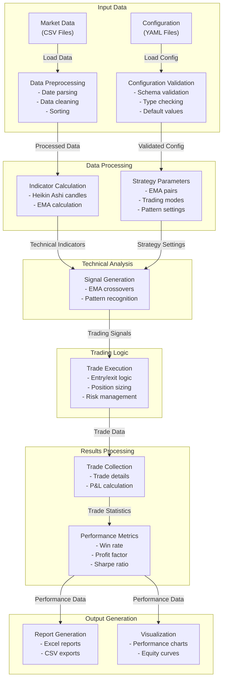

# EMA Heikin Ashi Strategy - Data Flow Diagram

This diagram illustrates the data flow within the EMA Heikin Ashi Strategy system.

## Data Flow Diagram

## Data Flow Components

### Input Data
- **Market Data**: Historical price data in CSV format
- **Configuration Data**: System configuration in YAML format

### Data Processing
- **Data Preprocessing**: Prepares market data for analysis
- **Configuration Validation**: Validates configuration settings

### Technical Analysis
- **Indicator Calculation**: Calculates technical indicators
- **Strategy Parameters**: Defines strategy parameters

### Trading Logic
- **Signal Generation**: Generates trading signals
- **Trade Execution**: Executes trades based on signals

### Results Processing
- **Trade Collection**: Collects trade data
- **Performance Metrics**: Calculates performance metrics

### Output Generation
- **Report Generation**: Generates reports
- **Visualization**: Creates visualizations of results
