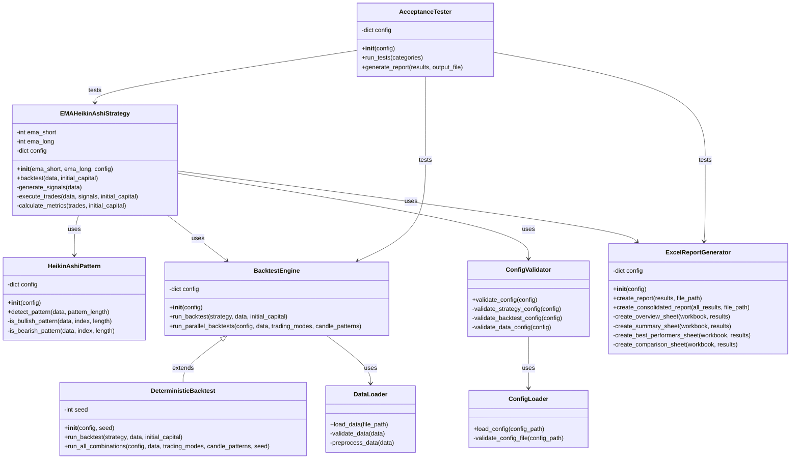

# EMA Heikin Ashi Strategy - Class Diagram

This diagram illustrates the main classes and their relationships in the EMA Heikin Ashi Strategy system.

## Class Diagram

## Class Descriptions

### EMAHeikinAshiStrategy
The main strategy class that implements the EMA Heikin Ashi trading strategy.

### HeikinAshiPattern
Detects Heikin Ashi candle patterns for trade signal confirmation.

### ConfigValidator
Validates configuration settings to ensure they meet requirements.

### BacktestEngine
Executes backtests of trading strategies against historical data.

### DeterministicBacktest
A specialized version of the backtest engine that ensures reproducible results.

### ExcelReportGenerator
Generates Excel reports with performance metrics and visualizations.

### DataLoader
Loads and preprocesses market data from CSV files.

### ConfigLoader
Loads configuration settings from YAML files.

### AcceptanceTester
Runs acceptance tests to validate system behavior against requirements.
